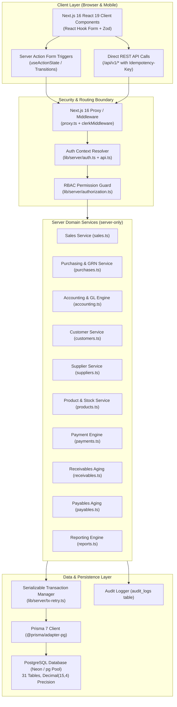
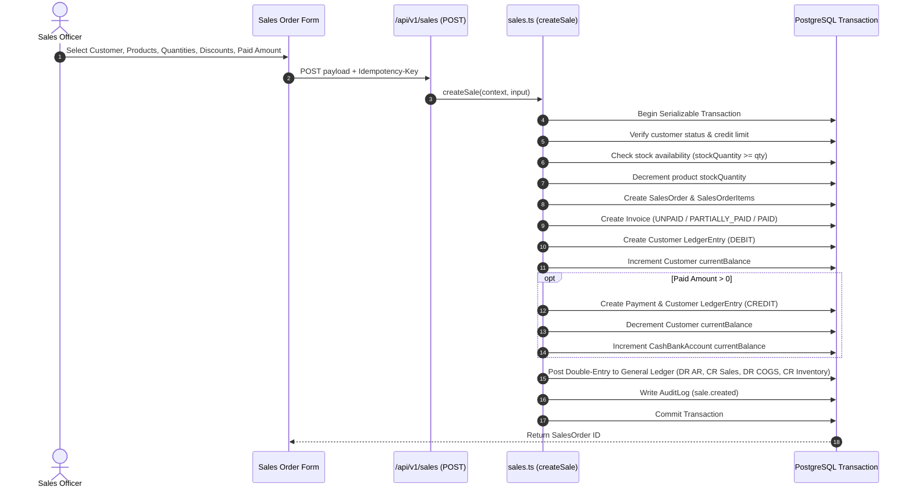
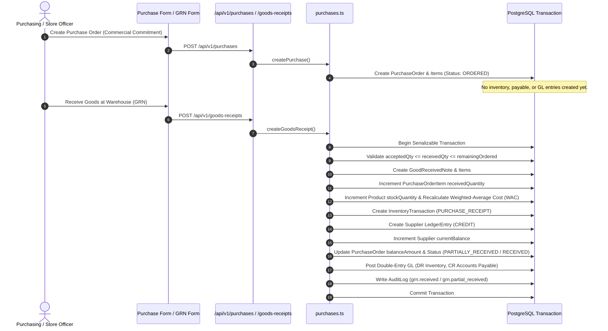
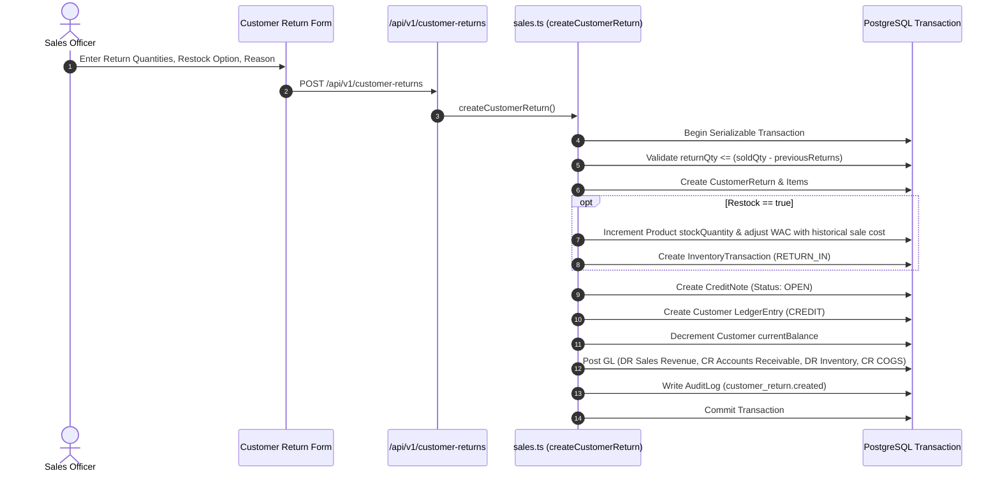
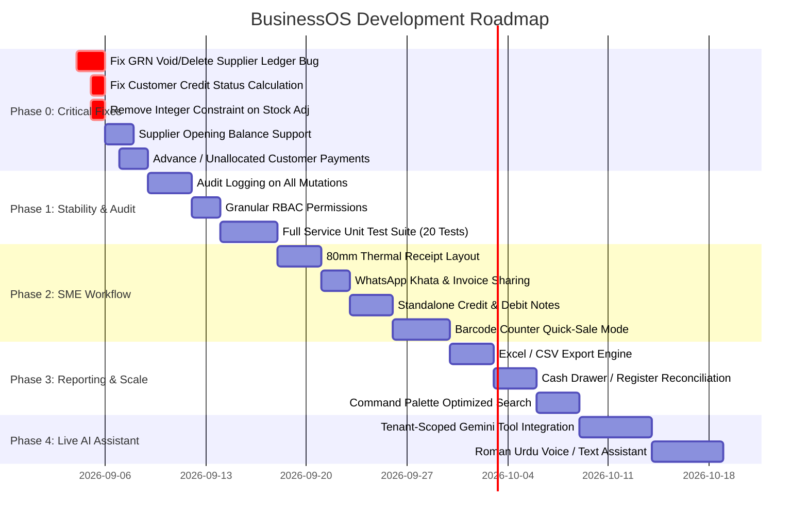

# BusinessOS Complete Audit

**Audit Date:** September 3, 2026  
**Auditor Role:** Principal Software Architect, Senior Full-Stack Engineer, QA Engineer, Security Reviewer, SME ERP Consultant  
**Target Domain:** Pakistani Wholesale, Spare Parts Distribution, Small Manufacturing, and SME Trading  
**Repository:** `every1hatestaha-png/busniessOS`

---

## 1. Executive Summary

BusinessOS is a multi-tenant business operations platform tailored for Pakistani SMEs (specifically auto-parts wholesalers, spare parts distributors, and trading businesses). The system provides core modules for Sales Orders, Invoicing, Customer Khata (Receivables), Purchasing (PO), Goods Received Notes (GRN), Supplier Khata (Payables), Multi-account Double-Entry General Ledger, Expense Vouchers, and Operational Reports.

The codebase is built on a modern foundation using Next.js 16 (App Router with `proxy.ts`), React 19, TypeScript 5 (strict mode), Tailwind CSS 4, Prisma 7 with PostgreSQL (`@prisma/adapter-pg` against Neon), Clerk Authentication, and Zod validation.

### Health & Readiness Scorecard

| Dimension | Score | Assessment |
| :--- | :---: | :--- |
| **Overall Health** | **74 / 100** | Strong architectural foundation and high domain ambition; marred by specific high-severity accounting reversal bugs, audit logging gaps, and incomplete SME workflow paths. |
| **Production Readiness** | **58 / 100** | Not ready for live production financial operations until critical ledger reversal bugs, missing advance payments, and supplier opening balance gaps are resolved. |
| **Architecture** | **84 / 100** | Clean repository design with server-only transactional domain services (`lib/server/*`), serializable retries, and strict schema definitions. |
| **Business Logic** | **68 / 100** | Excellent weighted-average costing (WAC) and PO/GRN separation, but contains severe defects in GRN void/delete supplier ledger reversals and credit limit defaults. |
| **Security** | **86 / 100** | Strict server-side workspace isolation on all business queries; robust session derivation. Minor issues in CORS preflight header whitelisting and missing RBAC granular permissions for purchasing/returns. |
| **UX & UI Design** | **78 / 100** | Clean, responsive interface with shadcn primitives and Base UI; friction exists around integer quantity restrictions, required 10-char descriptions, and overly strict SKU regex. |
| **Data Integrity** | **72 / 100** | Strong relational model with `Decimal(15,2)` and `Decimal(15,4)` types, but endangered by hard deletion of GRNs and floating-point math in report aggregators. |
| **Testing** | **45 / 100** | Unit tests cover only pure helpers; 14 integration test files exist but are deactivated in standard CI (`RUN_INTEGRATION_TESTS=false`). No automated unit test coverage for core service transactions. |
| **Performance** | **70 / 100** | Good indexing on primary foreign keys and search paths; N+1 risk in global search and large ledger aggregations without pagination. |
| **AI Readiness** | **25 / 100** | The assistant is currently an unauthenticated mock reading static demo data (`lib/demo-data.ts`). Not connected to tenant database or audited tools. |

---

## 2. Current Architecture

### Architecture Map

### Stack Breakdown

- **Framework**: Next.js 16.3.3 (App Router with Turbopack, React 19.2.8, React DOM 19.2.8)
- **Language**: TypeScript 5 (Strict Mode)
- **Database ORM**: Prisma 7.10.0 with `@prisma/adapter-pg` driver adapter
- **Database Engine**: PostgreSQL (Neon Serverless PostgreSQL connection pool with full SSL validation)
- **Authentication**: Clerk (`@clerk/nextjs` 7.8.2) with server-side cookie tenant resolution (`businessos_workspace`)
- **Validation**: Zod 4.4.3
- **Form Management**: React Hook Form 7.86.0 with `@hookform/resolvers`
- **UI & Styling**: Tailwind CSS 4, shadcn/ui, Base UI (`@base-ui/react` 1.7.0), Lucide React 1.34.0
- **Testing**: Vitest 4.1.11

---

## 3. Complete Feature Inventory

| Module | Feature | Status | Quality | Notes & Issues |
| :--- | :--- | :---: | :---: | :--- |
| **Auth & Tenancy** | Clerk Session Binding | Active | High | Upserts local `User` record from Clerk token automatically. |
| | Workspace Switching | Active | High | `businessos_workspace` cookie-based switching with strict membership check. |
| | Workspace Creation | Partial | Medium | Blocked for users who already have an existing workspace. |
| | Team Invitations | Active | High | Token-based invitations with 7-day expiry and auto-accept on signup. |
| **Sales** | Sales Order Creation | Active | High | Deducts stock, calculates COGS, creates invoice, updates customer balance. |
| | Order Discount & Line Discount | Active | High | Validates line discounts do not exceed line value. |
| | Integrated Immediate Payment | Active | High | Updates cash/bank balance and customer balance atomically. |
| | Sales Order Cancellation | Active | High | Reverses inventory with WAC, reverses GL, voids invoice, refunds payment. |
| | Customer Returns | Active | High | Creates Credit Note, restores stock (optional), posts GL revenue reversal. |
| | Credit Note Allocation | Active | High | Allocates credit note against open unpaid invoices. |
| **Purchasing** | Purchase Order Creation | Active | High | Supports Unit Pricing and Weight-Based Pricing (kg rate). |
| | Goods Received Note (GRN) | Active | High | Financial trigger: increments stock, recalculates WAC, creates payable. |
| | Partial Receiving | Active | High | Tracks `receivedQuantity` vs `orderedQuantity` per PO item. |
| | GRN Editing | Active | High | Reverses old WAC effects and applies new quantities atomically. |
| | GRN Voiding | Defective | Low | **Critical Bug**: Reverses supplier payable with a CREDIT instead of DEBIT. |
| | GRN Deletion | Defective | Low | **Critical Bug**: Hard-deletes posted GRN and credits supplier ledger. |
| | Supplier Returns | Active | High | Restocks out, generates Debit Note, decrements supplier payable. |
| **Khata (Receivables)** | Customer Directory & Balance | Active | High | Tracks current balance, credit limits, contact details. |
| | Receivables Aging Report | Active | High | Real-time aging buckets (Current, 1-30, 31-45, 46-60, 61+ days). |
| | Customer Statements | Active | High | Running balance ledger statement with drill-down links. |
| | Customer Payments | Partial | Medium | **Issue**: Blocks advance payments when customer balance is zero. |
| **Khata (Payables)** | Supplier Directory & Balance | Active | High | Real-time payable balance tracking. |
| | Supplier Opening Balance | Missing | Low | **Missing**: Cannot set opening balance when creating new supplier. |
| | Payables Aging Report | Active | High | Real-time aging buckets based on GRN receipt dates. |
| | Supplier Statements | Defective | Medium | Corrupted if any GRN was voided due to ledger reversal bug. |
| | Supplier Payment Vouchers | Active | High | Handles gross amount, withholding tax (WHT), and net payment. |
| **Inventory** | Product CRUD | Active | High | SKU, unit, category, cost price, selling price, reorder level. |
| | Stock Adjustments | Partial | Medium | Integer validation blocks fractional kg/liter adjustments. |
| | Stock Movements Report | Active | High | Chronological audit trail of all inventory transactions. |
| | Current Stock Valuation | Active | High | Valuation at cost with General Ledger reconciliation comparison. |
| **Accounting / GL** | Automated Double Entry | Active | High | Posts balanced journal entries for Sales, Receipts, Purchases, Returns. |
| | General Ledger Drilldown | Active | High | Account-level ledger with date filters and running balance. |
| | Cash & Bank Management | Active | High | Manages bank accounts and cash drawers with GL opening balances. |
| | Expense Vouchers | Active | High | Operating expenses debited to expense account, credited to cash/bank. |
| | Profit & Loss Statement | Active | High | Real-time P&L deriving revenue, COGS, and operating expenses. |
| **AI Assistant** | Natural Language Query | Mock | Low | Hardcoded to static demo data; no live tenant database connection. |
| **Search** | Global Search Bar | Active | Medium | Queries top 100 rows per entity; no backend pagination or indexing. |

---

## 4. Complete Workflow Map

### 1. Sales Workflow

- **Failure Paths**: Insufficient stock throws `INSUFFICIENT_STOCK`; exceeding credit limit throws `INVALID_TOTAL`; database concurrency conflict triggers `withSerializableRetry`.
- **Current Weakness**: Server action masks the specific error message, returning a generic error string.

---

### 2. Purchasing & Goods Receipt (GRN) Workflow

- **Failure Paths**: Receiving more than ordered throws `OVER_RECEIPT`; receiving against cancelled PO throws `CANCELLED_PO`.
- **Current Weakness**: If goods are rejected at the gate, accepted quantity is recorded, but no physical rejection slip / quarantine record is generated.

---

### 3. Customer Return & Credit Note Workflow

---

## 5. Critical Bugs

| ID | Severity | Area | Problem Description | Impact | Code Evidence | Recommended Fix |
| :--- | :---: | :--- | :--- | :--- | :--- | :--- |
| **BUG-01** | **CRITICAL** | Purchasing / GRN | `voidGoodsReceipt` records supplier ledger reversal as a `CREDIT` instead of `DEBIT`. | Voiding a GRN increases the supplier's payable balance on their statement instead of zeroing it out. Corrupts supplier ledger. | `lib/server/purchases.ts:1354` `type: "REVERSAL", credit: grn.totalAmount` | Change `credit: grn.totalAmount` to `debit: grn.totalAmount`. |
| **BUG-02** | **CRITICAL** | Purchasing / GRN | `deleteGoodsReceipt` records supplier ledger reversal as a `CREDIT` instead of `DEBIT`. | Deleting a GRN doubles the supplier credit liability in ledger history. | `lib/server/purchases.ts:1526` `type: "REVERSAL", credit: grn.totalAmount` | Change `credit: grn.totalAmount` to `debit: grn.totalAmount`. |
| **BUG-03** | **HIGH** | Customers / Khata | `getCreditStatus` flags all customers with `creditLimit = 0` as `"Over Limit"`. | Normal credit customers without an explicit cap display red "Over Limit" warnings across all UI tables. | `lib/utils.ts:57` `if (balance >= creditLimit) return "Over Limit"` | Update logic: `if (creditLimit <= 0) return "Normal"; if (balance >= creditLimit) return "Over Limit";`. |
| **BUG-04** | **HIGH** | Inventory Actions | `adjustStockAction` schema enforces integer quantities with `.int()`. | Users cannot adjust decimal stock quantities for kg, liters, or meters (e.g. 1.5 kg). | `app/(dashboard)/inventory/actions.ts:70` `quantity: z.coerce.number().int()` | Remove `.int()`: `quantity: z.coerce.number().refine((val) => val !== 0)`. |
| **BUG-05** | **HIGH** | Financial Integrity | Hard deletion of posted `GoodReceivedNote` records via API. | Destroys immutable audit trails and leaves dangling foreign keys in general ledger entries. | `lib/server/purchases.ts:1553` `tx.goodReceivedNote.delete(...)` | Remove hard delete. Require voiding with reason, retaining soft-voided record for audit compliance. |
| **BUG-06** | **HIGH** | Customer Payments | `recordPayment` strictly rejects advance payments when balance is zero. | Wholesalers cannot record advance token payments or customer credit deposits. | `lib/server/payments.ts:31` `if (amount.greaterThan(customer.currentBalance)) throw ...` | Allow unallocated payments; store excess as unallocated customer credit balance. |
| **BUG-07** | **MEDIUM** | Audit Trail | Invoices server action loses actor user ID during payment recording. | Payments recorded via UI show `actorId: null` in audit logs. | `app/(dashboard)/invoices/actions.ts:19-35` Passes `context` without flattening `userId: context.user.id`. | Pass `{ ...context, userId: context.user.id }` to `recordPayment`. |
| **BUG-08** | **MEDIUM** | Sales UI | `createSaleAction` masks domain error messages with generic fallback. | Users cannot see why order creation failed (e.g., specific out-of-stock product name). | `app/(dashboard)/sales/actions.ts:28-30` Returns static string. | Return `error.message` directly in `CreateSaleState.error`. |
| **BUG-09** | **MEDIUM** | CORS Preflight | CORS `ALLOWED_HEADERS` excludes `Idempotency-Key`. | Preflight `OPTIONS` requests from mobile apps/web clients fail when sending idempotency keys. | `lib/server/cors.ts:4` `const ALLOWED_HEADERS = "Authorization, Content-Type";` | Add `Idempotency-Key` to `ALLOWED_HEADERS`. |
| **BUG-10** | **MEDIUM** | Workspace Setup | `createInitialWorkspace` blocks existing users from creating additional workspaces. | Multi-business owners cannot register a second company under one Clerk identity. | `lib/server/onboarding.ts:15-16` `findFirst({ where: { userId } })` | Remove blocking check; allow creating new workspace and add membership as OWNER. |

---

## 6. Business Logic Problems

### 1. Lack of Supplier Opening Balance
- **Issue**: `createSupplier` does not accept an `openingBalance` field, unlike `createCustomer`.
- **Business Impact**: When a Pakistani auto-parts distributor transitions to BusinessOS, they already owe millions to existing distributors/importers (e.g., Thal Engineering, Atlas Battery). Currently, they cannot record opening supplier payables without fabricating dummy purchase orders.
- **Remedy**: Add `openingBalance` to `supplierSchema`, create an `OPENING_BALANCE` `LedgerEntry` (CREDIT), and post to General Ledger (DR `Owner Equity`, CR `Accounts Payable`).

### 2. Absence of Standalone Debit / Credit Notes
- **Issue**: Credit Notes are only created via Customer Returns, and Debit Notes are only created via Supplier Returns.
- **Business Impact**: In spare-parts distribution, price adjustments (e.g., supplier announced a 5% rebate, or customer received a post-sale volume discount) happen frequently without returning physical parts.
- **Remedy**: Provide direct Credit Note and Debit Note creation workflows with GL posting to `Discounts Allowed` / `Discounts Received`.

### 3. SKU Format Rejection for Automotive Part Numbers
- **Issue**: `productSchema` uses regex `/^[A-Za-z0-9-]+$/`.
- **Business Impact**: Automotive OEM numbers commonly use dots, slashes, and underscores (e.g., `04465-33450/A`, `NGK.BKR6E-11`, `DENSO_SK20HR11`). All such parts fail validation.
- **Remedy**: Relax SKU regex to allow alphanumeric characters, hyphens, slashes, dots, and underscores: `/^[A-Za-z0-9-._/ ]+$/`.

### 4. Compulsory 10-Character Description on Products
- **Issue**: `productSchema` requires `description: z.string().trim().min(10).max(500)`.
- **Business Impact**: Fast product entry during inventory intake is blocked unless arbitrary filler text is typed for self-explanatory products like "Oil Filter".
- **Remedy**: Make `description` optional with `.optional().default("")`.

---

## 7. Security Findings

| ID | Severity | Risk Type | Location | Impact | Recommendation |
| :--- | :---: | :--- | :--- | :--- | :--- |
| **SEC-01** | **MEDIUM** | Coarse Authorization | `lib/server/authorization.ts` | Lack of granular permissions for Purchasing, GRN, and Returns. `STAFF` role can be blocked from sales but has undefined purchase boundaries. | Define explicit permissions: `purchases.create`, `grn.create`, `returns.create`, `expenses.create`. |
| **SEC-02** | **MEDIUM** | Audit Completeness | `lib/server/customers.ts`, `products.ts` | `createCustomer`, `updateCustomer`, `createProduct`, `updateProduct`, and `adjustProductStock` do not write to `AuditLog`. | Call `writeAudit` inside all transactional mutations. |
| **SEC-03** | **LOW** | Idempotency Key Replay Mismatch | `lib/server/sales.ts:19-20` | `createSale` returns the existing order ID on matching idempotency key without verifying if the payload body matches the original request. | Verify payload checksum against original transaction metadata before returning idempotency match. |
| **SEC-04** | **LOW** | CORS Exposure | `lib/server/cors.ts:21-26` | Permissive regex matching for local dev ports. | Ensure strict production origin validation from environment variables. |

---

## 8. Data Integrity Findings

### 1. Monetary Precision
- **Schema**: PostgreSQL `Decimal(15,2)` for currency and `Decimal(15,4)` for stock quantities.
- **Evaluation**: The database schema is mathematically sound. However, intermediate JavaScript aggregations in `lib/accounting-math.ts` and `lib/reports.ts` occasionally cast to native JS `number` before calculating running balances, risking floating-point drift.
- **Recommendation**: Maintain `Prisma.Decimal` arithmetic across all service layers; only convert to `number` at the UI view boundary.

### 2. Referential Cascades vs Restrict
- `Product` has `onDelete: Restrict` on `SalesOrderItem`, `PurchaseOrderItem`, `GoodReceivedNoteItem`, `InventoryTransaction`. This correctly prevents accidental deletion of products with financial history.
- `Customer` and `Supplier` have `onDelete: Restrict` on financial foreign keys, protecting audit trails.

---

## 9. UX Problems

1. **Integer Stepping in Quantity Inputs**: `<Input type="number" min="1" step="1" />` across sales and purchase forms prevents fractional quantities.
2. **Missing Real-Time Stock Warning in Sales Form**: Sales form allows selecting products with low or zero stock; only fails on submit with a generic banner.
3. **No Barcode / Quick-Add Scanner**: Auto-parts distributors rely on barcode scanners at the counter. Lack of scanner support forces manual dropdown searching.
4. **No Thermal Slip (80mm) Receipt Format**: Wholesale markets in Plaza / Urdu Bazar Karachi operate on 80mm thermal counter slips. Standard A4 full-page layouts waste paper.
5. **No WhatsApp Direct Sharing**: Pakistani SME customers expect PDF invoices or khata balance summaries sent directly to WhatsApp with one click.

---

## 10. Performance Problems

1. **Unindexed Layout Search Query**: `getSearchResults` runs 4 separate `findMany({ take: 100 })` queries on every single page load inside `app/(dashboard)/layout.tsx`.
   - *Impact*: Under 10,000 orders, every click incurs ~150ms unnecessary database latency.
   - *Fix*: Move search to an on-demand API endpoint triggered only when the user opens the command palette.
2. **Unpaginated Ledger Aggregation**: `getGeneralLedger` loads all transactions in the period into memory to calculate running balance.
   - *Impact*: For high-volume accounts (>50,000 entries/year), memory consumption spikes on the Node.js server.
   - *Fix*: Implement database-level window functions (`SUM(debit - credit) OVER (...)`) with cursor-based pagination.

---

## 11. Testing Gaps

### Current Test Suite Assessment
- **Unit Tests (`tests/unit`)**: 6 files, 80 tests passing (covers regex helpers, CORS headers, aging day math, Clerk webhook payload parsing).
- **Integration Tests (`tests/integration`)**: 14 files present, but **excluded from standard test runs** (`vitest run` skips them unless `RUN_INTEGRATION_TESTS=true` is manually configured).
- **Critical Gap**: Zero unit test coverage for core service functions with database mocks.

### Top 20 Missing Tests That Must Exist

1. `createSale`: Stock decrement and COGS journal posting accuracy.
2. `createSale`: Rejection when credit limit is exceeded.
3. `createSale`: Exact cash/bank balance update on immediate payment.
4. `cancelSale`: Reversal of stock at historical weighted cost.
5. `cancelSale`: Reversal of initial payment and GL postings.
6. `createPurchase`: Weight-based pricing calculation (`unitWeight * perKgRate * qty`).
7. `createGoodsReceipt`: Partial receipt tracking on PO items.
8. `createGoodsReceipt`: Weighted-average cost recalculation on product.
9. `voidGoodsReceipt`: Verification of DEBIT reversal on supplier ledger.
10. `updateGoodsReceipt`: Delta cost and inventory balance adjustments.
11. `createSupplierReturn`: Stock reduction and Debit Note generation.
12. `createCustomerReturn`: Credit Note generation and AR reduction.
13. `recordPayment`: Invoice status transition to PAID and PARTIALLY_PAID.
14. `recordPayment`: Rejection of duplicate idempotency key with conflicting payload.
15. `recordSupplierPayment`: Withholding tax deduction and cash/bank decrement.
16. `allocateCustomerCredit`: Settlement of open invoice using credit note.
17. `createExpense`: GL entry balance and cash/bank balance reduction.
18. `getReceivablesAging`: Accurate bucket distribution across 1-30, 31-45, 46-60, 61+ days.
19. `getPayablesAging`: Accurate bucket distribution using GRN receipt dates.
20. `Tenant Isolation`: Cross-workspace query rejection on all endpoints.

---

## 12. Missing Features

### P0: Must-Have (Blocking Live Production)
- Fix GRN void/delete supplier ledger reversal (BUG-01, BUG-02).
- Support Supplier Opening Balance on creation.
- Allow Advance / Unallocated Customer Payments.
- Standalone Manual Credit Notes & Debit Notes (without returns).
- Fix Customer Credit Status formula (`creditLimit = 0`).
- Remove integer restriction from quantity inputs.

### P1: High Value (Operational Fit for Pakistani SMEs)
- WhatsApp Share button for invoices, payment receipts, and Khata statements.
- Printable 80mm Thermal Receipt format for POS counters.
- Barcode scanning support in Sales and Purchase forms.
- Multiple Warehouses / Godown locations tracking.
- Cash Register / Daily Drawer reconciliation (Opening Cash, Cash In, Cash Out, Closing Cash).
- Printable PDF Invoice & Statement Generation.

### P2: Useful (Management & Scale)
- Export to Excel / CSV for all reports and ledgers.
- Customer-specific price lists and bulk discount tiers.
- Purchase price history comparison across suppliers.
- Granular Role-Based Permissions (Separate Storekeeper, Salesman, Accountant).
- Bank reconciliation statement.

### P3: Future (Advanced Differentiators)
- Multi-branch synchronization.
- Automated FBR POS integration (Digital Invoicing compliance).
- AI automated receipt/bill OCR parsing.

---

## 13. AI Opportunities

| Workflow | Value | Difficulty | Risk | Architecture & Tools Required |
| :--- | :---: | :---: | :---: | :--- |
| **Natural Language Khata Query** *"Show customers owing > Rs 100k"* | **High** | Low | Low | Read-only SQL tool querying `Customer` and `ReceivablesAging`. Tenant-isolated. |
| **Roman Urdu Voice/Text Counter Assistant** *"Brake pad ka stock kitna hai?"* | **High** | Medium | Low | Fast semantic search over product catalog and current stock. |
| **Draft Purchase Order Generator** *"Create PO for items below reorder level"* | **High** | Medium | Medium | Tool generates a DRAFT PO; requires explicit human confirmation click before saving. |
| **Intelligent Payment Entry Proposal** *"Ali Autos se 50,000 cash aya"* | **High** | Medium | Medium | Extracts customer and amount, returns confirmation modal with invoice allocation preview. |
| **Margin Leakage & Price Hike Alert** *"Which supplier prices rose this month?"* | **Medium** | Low | Low | Analytical comparison of purchase order item costs over time. |

---

## 14. Efficiency Improvements

| Workflow | Current Workflow | Recommended Workflow | Steps Saved | Expected Benefit |
| :--- | :--- | :--- | :---: | :--- |
| **Create Sale & Collect Cash** | 1. Open Sales -> 2. New Order -> 3. Add products -> 4. Create Order -> 5. Open Invoices -> 6. Record Payment -> 7. Select Bank | 1. Open New Sale -> 2. Scan items -> 3. Enter paid amount & cash drawer -> 4. Submit | 3 steps | 60% faster checkout at busy wholesale counters. |
| **Receive Goods (GRN)** | 1. Open Purchases -> 2. Find PO -> 3. Click Receive -> 4. Enter quantities -> 5. Submit | 1. Command Bar (`/grn`) -> 2. Type PO Number -> 3. Fill quantities -> 4. Submit | 2 steps | Direct storekeeper receiving workflow. |
| **Send Khata Reminder** | 1. Open Khata -> 2. Find Customer -> 3. Copy balance -> 4. Open WhatsApp -> 5. Type message | 1. Customer Khata -> 2. Click "Share to WhatsApp" (prefilled template) | 3 steps | Instant payment collection follow-ups. |
| **Check Product Stock & Price** | 1. Open Inventory -> 2. Filter -> 3. Open Detail | 1. Global Command Palette (`Cmd+K`) -> Type SKU -> Instant popup | 2 steps | Zero page reloads while on the phone with a customer. |

---

## 15. SME Workflow Gaps

1. **Khata Culture in Pakistan**: Wholesalers deal on trust (*Parchi system* / *Khata*). Customers make lump-sum payments (e.g., Rs 100,000 against a total ledger of Rs 350,000 without specifying invoice IDs). BusinessOS currently forces strict invoice allocation on customer payments.
2. **Gate Rejections**: When a container or shipment arrives at the godown, damaged parts are rejected on the spot. BusinessOS records `receivedQuantity` and `acceptedQuantity`, but does not generate a Vendor Gate Pass or Rejection Memo.
3. **Withholding Tax (WHT) on Sales**: Pakistani tax rules require withholding tax deductions at source on wholesale supplies. BusinessOS supports WHT on supplier payments, but lacks WHT deductions on customer sales invoices.

---

## 16. Competitive Position

- **Ahead of Odoo / ERPNext**: Vastly simpler UI, zero bloat, instant setup, lightweight Next.js performance, tailor-made for Pakistani wholesale terminologies.
- **Competitive with Zoho Books / QuickBooks**: Strong double-entry accounting engine, real-time aging, and clean customer/supplier ledgers.
- **Behind Desktop Legacy ERPs (Sidekick, Candela, Softlink)**: Lacks 80mm thermal printing, barcode-driven rapid POS counter checkout, and offline resilience.
- **Unique Advantage**: Modern AI-ready architecture with Roman Urdu capabilities, clean multi-tenant isolation, and weight-based auto-parts pricing.

---

## 17. Technical Debt

### High Priority
- Hard deletion of GRN records in `lib/server/purchases.ts`.
- Inconsistent error handling in server actions (generic string masking).
- Incomplete audit logging across customer and product mutations.
- Floating-point math in report aggregators.

### Medium Priority
- Layout-level database queries in `app/(dashboard)/layout.tsx`.
- Coarse RBAC permission matrix in `lib/server/authorization.ts`.
- Integration tests disconnected from standard Vitest test runner.

---

## 18. Recommended Roadmap

---

## 19. Top 20 Recommendations

| Rank | Problem | Why It Matters | Expected Impact | Difficulty | Priority |
| :---: | :--- | :--- | :--- | :---: | :---: |
| **1** | Fix GRN void/delete supplier ledger credit bug | Corrupts supplier ledger statements on void. | Critical Data Integrity | Low | **P0** |
| **2** | Support Supplier Opening Balance | Essential for onboarding existing businesses. | Critical Onboarding | Low | **P0** |
| **3** | Allow Unallocated & Advance Customer Payments | Real-world Pakistani SMEs operate on advance deposits. | Critical Business Fit | Medium | **P0** |
| **4** | Fix `getCreditStatus` zero-limit logic | Stops false "Over Limit" warnings on all customers. | High UX / Accuracy | Low | **P0** |
| **5** | Allow decimal stock adjustments | Auto-parts and hardware sell items by weight (kg). | High Operability | Low | **P0** |
| **6** | Implement Standalone Credit & Debit Notes | Essential for post-sale discounts and price adjustments. | High Financial | Medium | **P1** |
| **7** | Add WhatsApp Direct Share for Invoices & Ledgers | The #1 communication channel for Pakistani trade. | High User Delight | Low | **P1** |
| **8** | Add 80mm POS Thermal Slip Printing | Counter standard for wholesale markets. | High Operations | Medium | **P1** |
| **9** | Complete Audit Logging on all entity mutations | Ensures accountability across multi-user staff. | High Compliance | Low | **P1** |
| **10** | Relax Product SKU Regex and Description Constraint | Stops blocking part numbers with dots/slashes. | High Data Entry Speed | Low | **P1** |
| **11** | Unmask Specific Server Action Error Messages | Users can debug why sales/purchases fail. | High UX Clarity | Low | **P1** |
| **12** | Replace Layout Search Queries with On-Demand Search | Eliminates 150ms latency on every page load. | High Performance | Medium | **P1** |
| **13** | Add Barcode Scanner Support to POS/Sales Form | Dramatically accelerates counter checkout. | High Efficiency | Medium | **P2** |
| **14** | Add Cash Drawer / Register Reconciliation | Tracks daily physical cash in hand vs system cash. | High Financial Control| Medium | **P2** |
| **15** | Add Excel / CSV Export for All Reports | Essential for external accountant audits. | High Utility | Low | **P2** |
| **16** | Implement 20 Core Service Unit Tests | Protects business logic from regression. | High Engineering | Medium | **P2** |
| **17** | Add Granular RBAC Permissions for Purchasing | Prevents staff from viewing supplier cost prices. | Medium Security | Low | **P2** |
| **18** | Connect AI Assistant to Live Tenant DB with Tools | Delivers on the "AI-first Operating System" vision. | High Differentiation | High | **P3** |
| **19** | Implement Multiple Warehouse / Godown Locations | Standard for distributors with separate godowns. | High Scale | High | **P3** |
| **20** | Add FBR POS Digital Invoicing Integration | Long-term compliance for tier-1 retailers in Pakistan. | High Regulatory | High | **P3** |

---

## 20. Things We Should NOT Build Yet

To prevent feature creep and wasted engineering effort, avoid:
1. **Multi-Currency Forex Revaluation Engine**: 99.5% of local Pakistani SME operations transact strictly in PKR.
2. **Complex Manufacturing BOM / MRP Routings**: Small assemblers require simple stock bundling, not aerospace-grade MRP II.
3. **Automated Bank Feed Scraping**: Pakistani banking APIs (1Link/Raast) lack open consumer banking feed integrations for third-party SaaS without extensive commercial banking partnerships.
4. **Autonomous AI Auto-Execution**: Never allow AI to execute financial transactions without explicit human modal confirmation.
5. **Subscription Billing Engine**: Unnecessary for wholesale ERP users who buy and sell physical goods.

---

## 21. Final Verdict

### 1. Is the current architecture worth continuing?
**Yes, absolutely.** The core foundation (Next.js 16 App Router, TypeScript, Prisma 7, PostgreSQL with Decimal types, strict workspace isolation) is modern, clean, and architecturally sound.

### 2. Should the project be refactored or incrementally improved?
**Option B: Incrementally improved.**  
There is no need for an architectural rewrite. The database schema and service boundaries are well structured. The project requires targeted fixes for specific business logic bugs, audit completeness, and SME-specific workflow enhancements.

### 3. What are the biggest risks?
- **Data corruption on voided transactions** (BUG-01/02) if deployed to live businesses before fixing.
- **User rejection** if basic Pakistani trading realities (advance payments, supplier opening balances, WhatsApp sharing, 80mm thermal slips) are absent.

### 4. What would prevent this from becoming a real SaaS?
Deploying with the current AI mock and unaddressed supplier ledger reversal defects. Once Phase 0 and Phase 1 fixes are applied, this system is primed for commercial deployment.

### 5. What should we build next?
Execute **Phase 0: Critical Fixes** immediately:
1. Fix the GRN void/delete supplier ledger credit bug.
2. Add supplier opening balance support.
3. Enable advance/unallocated customer payments.
4. Fix customer credit status zero-limit calculation.
5. Fix decimal stock adjustments.

### 6. What should we stop doing?
Stop building isolated demo UI features. Every new capability must be fully wired to transactional PostgreSQL persistence with audit logging.

### 7. What would make BusinessOS genuinely differentiated?
A lightning-fast, WhatsApp-integrated, Roman Urdu-enabled operating system that lets an auto-parts wholesaler in Karachi or Lahore manage their counter sales, supplier payables, and customer khata in seconds without needing an accounting degree.
